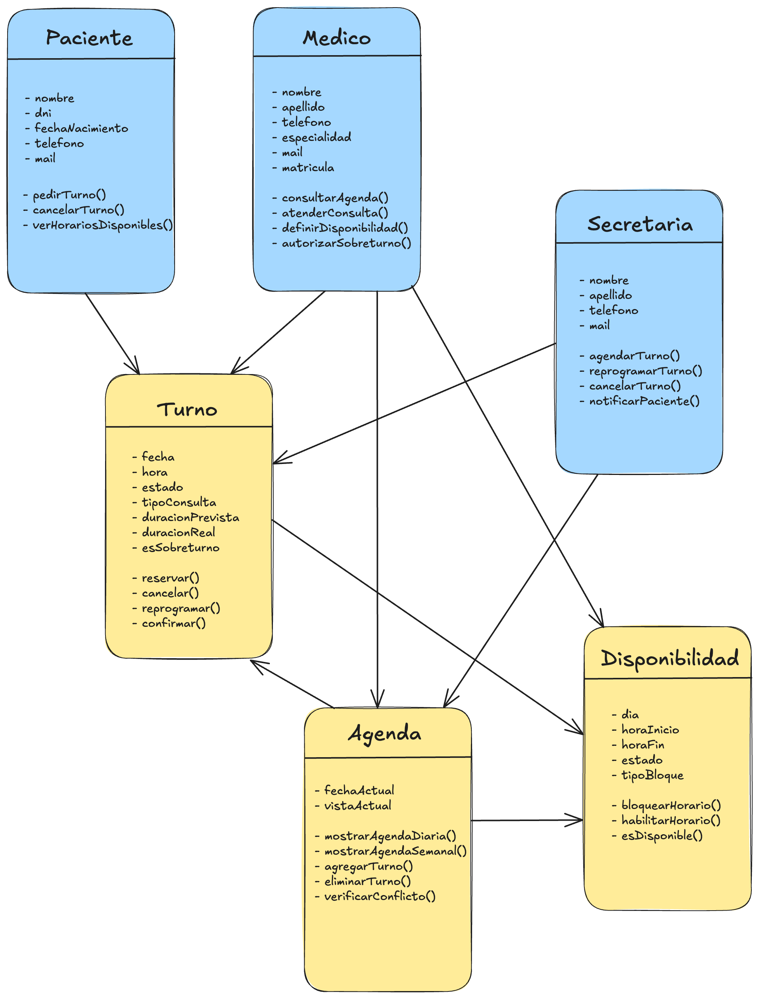

# Introducción al Diseño Orientado a Objetos

---

## Descripción del paradigma orientado a objetos

El paradigma orientado a objetos (POO) es un modelo de programación que organiza el software en torno a **objetos**: entidades que combinan datos (atributos) y comportamiento (métodos) en una única unidad. En lugar de pensar el programa como una secuencia de instrucciones, la POO nos invita a modelar el mundo real como un conjunto de objetos que interactúan entre sí.

Es importante porque permite construir sistemas más fáciles de entender, mantener y extender. Cuando el modelo refleja fielmente cómo funciona el dominio real —en nuestro caso, un consultorio médico— los cambios futuros se pueden introducir sin romper lo que ya funciona. La POO también favorece la reutilización del código y la separación clara de responsabilidades entre las partes del sistema.

---

## Los cuatro fundamentos de POO

### 1. Encapsulamiento

El encapsulamiento consiste en ocultar el estado interno de un objeto y exponer solo las operaciones que otros objetos pueden usar para interactuar con él.

**Ejemplo en el proyecto:** La clase `Agenda` es la única responsable de agregar, quitar y verificar turnos. Ninguna otra parte del sistema puede manipular directamente la lista interna de turnos. Si la secretaria quiere agregar un turno, debe hacerlo a través de la operación `agregarTurno()` de la agenda, que internamente verifica que no haya conflictos de horario. Esto garantiza que la regla de no superposición nunca pueda ser violada accidentalmente.

```
Agenda
─────────────────────────
- turnos: lista (privada)
─────────────────────────
+ agregarTurno()
+ eliminarTurno()
+ verificarConflicto()
+ mostrarAgendaDiaria()
```

### 2. Abstracción

La abstracción consiste en representar solo los aspectos relevantes de una entidad para el sistema, dejando de lado los detalles que no importan en este contexto.

**Ejemplo en el proyecto:** Un `Paciente` en este sistema no es una persona completa — es la representación mínima necesaria para gestionar turnos: nombre, DNI, teléfono y mail. No modelamos su historial médico, su obra social ni sus antecedentes clínicos, porque eso está fuera del alcance del sistema de turnos. La abstracción nos permite enfocarnos en lo que el sistema realmente necesita saber.

```
Paciente
─────────────────────────
- nombre
- dni
- telefono
- mail
─────────────────────────
+ pedirTurno()
+ cancelarTurno()
```

### 3. Herencia

La herencia permite que una clase (subclase) comparta atributos y comportamiento de otra clase (superclase), evitando duplicación y estableciendo una jerarquía natural entre conceptos del dominio.

**Ejemplo en el proyecto:** Tanto `Paciente` como `Medico` y `Secretaria` comparten características básicas de una persona: nombre, apellido, teléfono y mail. Podría existir una clase base `Persona` que contenga esos atributos comunes, y cada rol especializado herede de ella agregando solo lo que le es propio. El `Medico` agrega matrícula y especialidad; la `Secretaria` agrega sus operaciones de gestión de agenda.

```
        Persona
       /       \
  Paciente    Medico    Secretaria
```

> Decisión de diseño: en el MVP esta jerarquía está identificada pero no implementada todavía. El modelo está preparado para incorporarla sin romper la estructura existente.

### 4. Polimorfismo

El polimorfismo permite que objetos de distintos tipos respondan al mismo mensaje de formas diferentes, según su naturaleza específica.

**Ejemplo en el proyecto:** El sistema maneja distintos tipos de consulta (`Control` y `Primera vez`), y cada uno tiene una duración estimada diferente (15 y 30 minutos respectivamente). El método `calcularDuracion()` puede comportarse de forma distinta según el tipo de consulta, sin que el resto del sistema necesite saber cuál es. En el futuro, si se agregan nuevos tipos de consulta (por ejemplo, `Procedimiento`), solo se necesita definir su propio comportamiento sin modificar el código existente.

```
TipoConsulta (abstracto)
+ calcularDuracion()

  Control            PrimeraVez
  + calcularDuracion()  + calcularDuracion()
    → 15 min              → 30 min
```

---

## Requisitos iniciales del sistema

> Los siguientes requisitos fueron extraídos de los materiales provistos por el cliente: mail de la secretaria, transcripción de la reunión de kickoff, notas del cuaderno del Dr. Molina, mensajes de WhatsApp y conversaciones de Slack del equipo de desarrollo.
>  Cuaderno de análisis en NotebookLM: (https://notebooklm.google.com/notebook/b808f1f4-eec6-4b87-8227-de8a3ff5a60b)

### Requisitos Funcionales

**RF1 — Gestión de turnos**
El sistema debe permitir crear, reprogramar y cancelar turnos. Al crear un turno, el sistema debe verificar que no exista otro turno en el mismo horario para el mismo profesional. La operación de reprogramación debe registrar el cambio en el historial. La cancelación puede ser iniciada por la secretaria o por el propio paciente, pero siempre debe quedar registrada.

**RF2 — Control de superposición y sobreturnos**
El sistema debe impedir que se asignen dos turnos en el mismo horario, salvo cuando el médico autorice explícitamente un sobreturno. Los sobreturnos no se generan automáticamente: deben ser habilitados manualmente por el profesional. El sistema debe registrar que un turno es sobreturno y quién lo autorizó.

**RF3 — Visualización de agenda**
El sistema debe permitir visualizar la agenda del profesional por día y por semana. La vista debe mostrar los turnos existentes, los horarios bloqueados y los sobreturnos diferenciados. La sercretaria y el médico deben poder acceder a esta vista.

**RF4 — Gestión de disponibilidad del profesional**
El sistema debe permitir definir el horario habitual del profesional (lunes a viernes de 9:00 a 13:00 y de 15:00 a 19:00) y registrar excepciones: días bloqueados por vacaciones, feriados o actividades especiales. Los sábados son opcionales y se definen mes a mes. El sistema no debe permitir agendar turnos en horarios bloqueados.

**RF5 — Notificaciones al paciente**
El sistema debe enviar notificaciones automáticas al paciente en los siguientes casos: recordatorio el día anterior al turno (y opcionalmente el mismo día a la mañana), aviso de reprogramación y aviso de cancelación. El canal preferido es WhatsApp; el mail es alternativa. Las notificaciones deben quedar registradas en el sistema.

**RF6 — Registro de llegada del paciente**
El sistema debe permitir registrar la llegada física del paciente al consultorio. Al registrar la llegada, se debe guardar la hora real de arribo. Este registro es creado por la secretaria cuando el paciente se anuncia en recepción. Si el paciente nunca llega, el registro no existe. La tolerancia de llegada es de 10 minutos, pero la decisión de atender o reprogramar al paciente tardío la toma el médico caso por caso.

**RF7 — Historial de cambios**
El sistema debe mantener un historial completo de todas las modificaciones realizadas sobre los turnos: quién realizó el cambio, qué tipo de modificación fue y en qué momento ocurrió. Este historial debe ser consultable para resolver disputas entre pacientes y personal del consultorio.

### Requisitos No Funcionales

**RNF1 — Usabilidad**
El sistema debe tener interfaces diferenciadas para cada actor: secretaria, médico y paciente. La interfaz debe ser intuitiva y no requerir capacitación extensa. El médico en particular necesita una vista simple que no le demande aprender funcionalidades complejas.

**RNF2 — Seguridad y privacidad**
Los datos personales de los pacientes (nombre, DNI, fecha de nacimiento, teléfono, mail) deben estar protegidos. El acceso al sistema debe estar restringido por rol: la secretaria gestiona la agenda, el médico autoriza sobreturnos y consulta su agenda, el paciente solo ve y gestiona sus propios turnos.

**RNF3 — Extensibilidad**
El sistema debe estar diseñado para soportar el crecimiento a múltiples profesionales sin necesidad de rediseñar la arquitectura. La agenda debe pertenecer al profesional como concepto, de forma que agregar un segundo médico implique simplemente crear una nueva agenda, no modificar la lógica existente.

**RNF4 — Disponibilidad y confiabilidad**
El sistema debe estar disponible en el horario de atención del consultorio. No debe perder datos ante errores. Las operaciones críticas (crear, cancelar, reprogramar turno) deben confirmarse antes de ejecutarse.

**RNF5 — Trazabilidad**
Toda acción realizada en el sistema debe quedar registrada con fecha, hora y usuario responsable. Esto aplica especialmente a modificaciones de turnos, autorizaciones de sobreturnos y registros de llegada, ya que el consultorio necesita poder auditar quién hizo qué ante cualquier disputa.

---

# Casos de Uso
## CU 1 : Registro de Paciente
   - Actor:  Secretaria / Médico
   - Objetivo: Permitir un nuevo paciente en el sistema.
   - Flujo principal: 
      - **1:** El/La recepcionista accede al sistema.
      - **2:** Selecciona la opción "Registrar paciente".
      - **3:** Ingresa los datos del paciente.
      - **4:** Confirma la información.
      - **5:** El sistema guarda los datos.
   - Precondición: El sistema está en funcionamiento.
   - Postcondición: El paciente queda registrado en el sistema.
## CU 2 : Agendar Turno
   - Actor: Secretaria / Médico
   - Descripción: Permite reservar un espacio de tiempo en la agenda del profesional.
   - Flujo Principal:
      - **1:** La secretaria busca disponibilidad en la agenda del profesional.
      - **2:** Selecciona un horario libre y define el tipo de consulta para que el sistema estime la duración. 
      - **3:** El sistema valida que el horario este disponible y no haya conflictos con la agenda.
      - **4:** La secretaria asocia los datos del paciente al turno.
      - **5:** El sistema confirma la reserva y bloquea el horario.
   - Precondición: El profesional debe tener su disponibilidad registrada en el sistema.
   - Postcondición: El turno queda registrado en estado activo y el horario se visualiza como ocupado en la agenda.
## CU 3 : Reprogramar Turno
   - Actor: Secretaria
   - Descripción: Modifica la fecha o el horario de un turno ya establecido previamente.
   - Flujo Principal:
      - **1:** La secretaria selecciona el turno existente desde la visualización de la agenda.
      - **2:** Selecciona la nueva fecha y hora solicitada por el paciente.
      - **3:** El sistema confirma que el nuevo horario solicitado esté disponible.
      - **4:** Se confirma el cambio, el sistema libera el horario anterior y ocupa el nuevo.
      - **5:** El sistema registra automáticamente el movimiento en el historial de cambios.
   - Precondición: Debe existir un turno agendado previamente en el sistema.
   - Postcondición: El turno se actualiza con la nueva información y el cambio queda registrado para auditoría.
## CU 4 : Cancelar Turno
   - Actor: Secretaria
   - Descripción: Permite la cancelación de un turno existente.
   - Flujo Principal:
      - **1:** La secretaria busca el turno en la agenda.
      - **2:** Selecciona la opción de cancelar el turno.
      - **3:** El sistema solicita el registro del motivo de cancelación y lo guarda en el historial de cambios.
      - **4:** El sistema cambia el estado del turno a "cancelado" y libera el horario bloqueado.
      - **5:** El sistema notifica la cancelación del turno.
   - Precondición: Debe existir un turno previamente agendado.
   - Postcondición: El horario queda disponible nuevamente y se registra en el historial de cambios.
## CU 5 : Registro de llegada del paciente (Check-in)
   - Actor: Secretaria
   - Descripción: Registrar la llegada del paciente al consultorio.
   - Flujo Principal:
      - **1:** El paciente llega a la recepción.
      - **2:** La secretaria busca el turno del paciente en la agenda.
      - **3:** La secretaria marca al paciente como "presente".
      - **4:** El sistema registra la hora real de llegada del paciente
      - **5:** El sistema envia una notificación automática al profesional anunciando la llegada del paciente.
   - Precondición: El paciente debe tener un turno agendada para la fecha.
   - Postcondición: El estado de presencia es visible para el profesional en su agenda, permitiéndole organizar el flujo de atención.
## CU 6 : Autorización de Sobreturno
   - Actores : Médico / Secretaria
   - Descripción: Agregar turno en un horario ya ocupado o fuera del esquema habitual.
   - Flujo Principal:
      - **1:** La secretaria identifica un caso de urgencia o insistencia del paciente donde no hay disponibildad.
      - **2:** La secretaria consulta al profesional sobre la posibilidad de agendar un sobreturno.
      - **3:** El profesional autoriza la excepción(Limite de 2 sobreturnos)
      - **4:** La secretaria confirma e ingresa el nuevo turno en el sistema.
      - **5:** El sistema permite la superposición de un horario específico y registra la marca de Sobreturno.
   - Precondición: El horario solicitado debe estar ocupado o bloqueado por el sistema.
   - Postcondición: Se crea un turno adicional superpuesto que el profesional visualiza en su agenda diaria.


---

## Boceto inicial del diseño de clases

El diagrama de clases inicial se encuentra en:

📁 [`diagramas/01-diagrama-clases/01-boceto-inicial.excalidraw`](../diagramas/01-diagrama-clases/01-boceto-inicial.excalidraw)



### Clases identificadas

| Clase | Responsabilidad principal |
|---|---|
| `Paciente` | Representa a la persona que solicita turnos |
| `Medico` | Profesional dueño de la agenda; autoriza sobreturnos |
| `Secretaria` | Opera la agenda en nombre del médico |
| `Turno` | Unidad central del sistema; conecta paciente, médico y tiempo |
| `Agenda` | Controla la disponibilidad y evita conflictos de horario |
| `Disponibilidad` | Define los bloques de tiempo habilitados o bloqueados |
| `RegistroPresencia` | Registra la llegada física del paciente al consultorio |

### Decisiones de diseño justificadas

- **`Agenda` como controlador central:** La agenda es la única responsable de verificar conflictos. Ninguna otra clase puede agregar turnos directamente — esto garantiza la regla de no superposición (encapsulamiento).
- **`Disponibilidad` como clase separada:** Los horarios habituales y las excepciones (sábados variables, feriados, vacaciones) se modelan como objetos propios, no como simples atributos de fecha, porque tienen comportamiento propio (`esDisponible()`, `bloquearHorario()`).
- **`RegistroPresencia` como entidad independiente:** La llegada del paciente no es un estado del turno — es un evento físico que puede ocurrir antes del horario previsto o no ocurrir nunca. Modelarlo como clase separada preserva esta distinción (abstracción).
- **Herencia pendiente:** `Paciente`, `Medico` y `Secretaria` comparten atributos de persona. La jerarquía con clase base `Persona` está identificada pero no implementada en esta etapa — decisión consciente para mantener el modelo simple en el MVP.