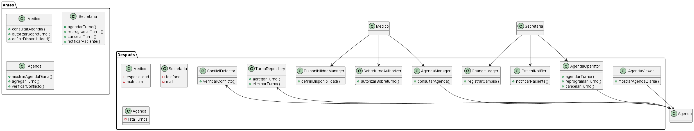

# Principio de Responsabilidad Única (SRP)

## Propósito y Tipo del Principio SOLID

El Principio de Responsabilidad Única (SRP), formulado por Robert C. Martin como parte de los principios SOLID, establece que una clase debe tener una única razón para cambiar, lo que implica que cada clase debe asumir una sola responsabilidad dentro del sistema. Este principio se clasifica como un principio de cohesión, ya que promueve la creación de clases altamente cohesionadas y con un bajo grado de acoplamiento, facilitando la modularidad y la mantenibilidad del código.

## Motivación

En el diseño inicial del sistema de turnos médicos, diversas clases principales acumulan múltiples responsabilidades, contraviniendo el SRP y generando un código propenso a errores y difícil de mantener. Por ejemplo, la clase `Medico` no solo representa los datos del profesional médico, sino que también incorpora lógica para consultar agendas, autorizar sobreturnos y gestionar disponibilidades. Esta violación implica que un cambio en la lógica de autorización de sobreturnos podría inadvertidamente afectar la representación básica del médico, incrementando el riesgo de regresiones y complicando las pruebas unitarias. Aplicar el SRP mediante la refactorización permite descomponer estas responsabilidades en clases especializadas, promoviendo un desarrollo más ágil y una evolución sostenible del sistema.

### Ejemplos de Violaciones y Refactorización

#### 1. Clase `Medico`
**Responsabilidades actuales (múltiples):**s
- Representar los datos personales y profesionales del médico.
- Consultar y gestionar la agenda del médico.
- Autorizar sobreturnos excepcionales.
- Definir y gestionar la disponibilidad horaria.

**Problemas de mantenibilidad que genera:**
- Modificaciones en la lógica de autorización de sobreturnos requieren alterar la clase `Medico`, lo que puede impactar inadvertidamente la gestión de agendas y aumentar el riesgo de errores.
- La mezcla de responsabilidades dificulta las pruebas unitarias, ya que se requieren mocks para múltiples aspectos simultáneamente.
- La clase se vuelve compleja y propensa a cambios frecuentes, violando el principio de una sola razón para cambiar.

**Propuesta de refactorización aplicando SRP:**
- `Medico`: Clase dedicada exclusivamente a representar los datos del profesional médico (especialidad, matrícula, datos personales).
- `AgendaManager`: Responsable únicamente de consultar y mostrar la agenda.
- `SobreturnoAuthorizer`: Encargada de manejar la autorización de sobreturnos.
- `DisponibilidadManager`: Gestiona la definición y actualización de horarios disponibles.

#### 2. Clase `Secretaria`
**Responsabilidades actuales (múltiples):**
- Representar los datos de contacto de la secretaria.
- Gestionar turnos en la agenda (agendar, reprogramar, cancelar).
- Registrar cambios en el historial del sistema.
- Notificar a pacientes sobre modificaciones en sus turnos.

**Problemas de mantenibilidad que genera:**
- La combinación de operaciones administrativas con funcionalidades de comunicación dificulta la modificación de notificaciones sin afectar la gestión de turnos.
- La clase aumenta en tamaño y complejidad, generando múltiples dependencias que complican su reutilización.
- Las pruebas requieren simulaciones para notificaciones y operaciones de agenda, incrementando la fragilidad de los tests.

**Propuesta de refactorización aplicando SRP:**
- `Secretaria`: Clase enfocada en los datos de contacto de la secretaria.
- `AgendaOperator`: Realiza operaciones CRUD (crear, leer, actualizar, eliminar) en la agenda.
- `ChangeLogger`: Registra cambios en el historial del sistema.
- `PatientNotifier`: Envía notificaciones a pacientes de manera especializada.

#### 3. Clase `Agenda`
**Responsabilidades actuales (múltiples):**
- Coordinar la disponibilidad general del médico.
- Agregar y eliminar turnos de la agenda.
- Detectar conflictos de horarios entre turnos.

**Problemas de mantenibilidad que genera:**
- La lógica de coordinación se entrelaza con operaciones de datos y validaciones, dificultando la separación de concerns.
- Cambios en la detección de conflictos pueden afectar la visualización de la agenda, generando efectos colaterales no deseados.
- La reutilización de componentes individuales se ve obstaculizada por la falta de especialización.

**Propuesta de refactorización aplicando SRP:**
- `Agenda`: Coordina las operaciones relacionadas con la agenda de manera centralizada.
- `TurnoRepository`: Maneja el almacenamiento y recuperación de turnos.
- `ConflictDetector`: Valida conflictos de horarios de forma independiente.
- `AgendaViewer`: Gestiona la visualización y presentación de la agenda.

## Explicación de Herencia / Aplicación del SRP

El SRP se aplica identificando las responsabilidades de cada clase y separándolas en clases independientes. En el contexto del sistema de turnos médicos, esto implica extraer responsabilidades como gestión de agenda, notificaciones y validaciones en clases separadas. La herencia puede usarse para compartir comportamientos comunes, pero el SRP prioriza la separación de responsabilidades sobre la jerarquía.

## Estructura de Clases (con imagen)

## Justificación Técnica

La aplicación del SRP en el sistema de turnos médicos mejora la arquitectura mediante la reducción del acoplamiento y el incremento de la cohesión. Técnicamente, esto se traduce en beneficios como una menor complejidad ciclomática, que facilita la comprensión y modificación de clases más pequeñas; una mejor testabilidad, permitiendo pruebas aisladas de cada responsabilidad; y una mayor reutilización de código, ya que componentes especializados pueden integrarse en otros contextos. Además, establece una base sólida para el cumplimiento de otros principios SOLID, como el Principio Abierto-Cerrado (OCP) y el Principio de Sustitución de Liskov (LSP). El diagrama adjunto ilustra esta separación de responsabilidades, contrastando las clases originales —que agrupan múltiples métodos en una sola entidad— con las clases refactorizadas, organizadas en paquetes especializados ("Antes" y "Después") que muestran relaciones claras y responsabilidades únicas, promoviendo una arquitectura más modular y escalable. En el contexto del proyecto, esta refactorización prepara el sistema para expansiones futuras, como la integración con sistemas externos o la incorporación de nuevos tipos de consultas, sin comprometer la estabilidad del código existente.