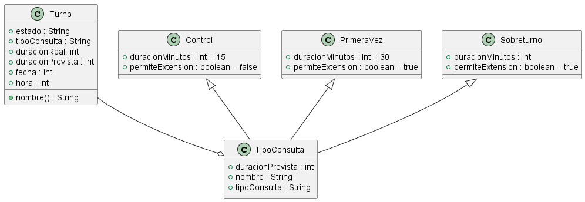

# Principio Abierto/Cerrado (OCP)

## Propósito y Tipo del principio SOLID
El principio de Abierto/Cerrado (OCP) implica que el comportamiento de un módulo puede ser extendido para satisfacer nuevos requerimientos sin necesidad de alterar su código fuente original.

- Abierto para la extensión: Significa que es posible ampliar el comportamiento del módulo a medida que cambian los requisitos de la aplicación
- Cerrado para la modificación: Significa que el código fuente de dicho módulo es inviolable y no debe ser retocado, ya que está probado y funciona correctamente. Modificarlo podría introducir errores en cascada o bugs inesperados.

## Motivación
El problema en el diseño actual, la lógica esta mezclada dentro de las clases. Por ejemplo si la clase `turno` tiene un procedimiento para calcular la duración según el tipo de consulta, cada vez que agregamos un nuevo tipo de consulta, debemos modificar el código existente de `turno`, lo que introduce riesgo de errores y viola el principio OCP.

El principio OCP lo resuelve cerrando el código fuente (La clase turno no se toca), y se abre para la extensión, creando nuevas clases que extiendan el comportamiento.

## Explicación de Herencia
La herencia es un mecanismo que permite que una subclase herede atributos y comportamientos de una superclase.

En el Sistema de Turnos se aplica en dos casos principales:

1) Turno
    - `tipoConsulta`(superclase abstracta)
    - `Control`,`PrimeraVez`,`Sobreturno`(subclases)

2) Disponibilidad
    - `ReglaDisponibilidad` (superclase abstracta)
    - `DisponibilidadMedico`, `DisponibilidadSecretaria` (subclases)

## Estructura de Clases

## Justificación técnica

En el diagrama UML vemos, como a partir de la clase principal `Turno`, se genera una superclase abstracta `TipoConsulta` la cual a su vez tiene tres subclases `Control`,`PrimeraVez`,`Sobreturno`. Lo que hace el principio OCP es que se pueda agregar otro método a la clase principal `Turno` a través de subclases generadas a partir de la superclase abstracta `TipoConsulta`, sin tener que modificar directamente la clase principal y evitando posibles errores o bugs.