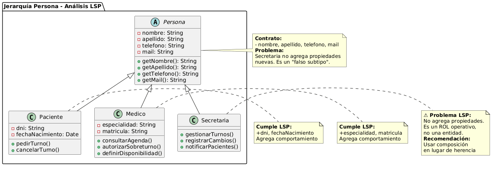

# Principio de Sustitución de Liskov (LSP)

## Propósito y Tipo del Principio SOLID

El principio de sustitución de Liskov (LSP) establece que los objetos de una superclase deben poder ser reemplazados por objetos de sus subclases sin alterar el funcionamiento correcto del programa.

En otras palabras: si `S` es una subclase de `T`, entonces los objetos de tipo `T` deberían poder ser reemplazados por objetos de tipo `S` sin modificar las propiedades correctas del programa.

## Motivación

En el Sistema de Turnos Médicos es necesario trabajar de forma polimórfica con diferentes actores del sistema. Por este motivo se creó la jerarquía `Persona` → `Paciente`, `Medico`, `Secretaria`.

La necesidad de aplicar LSP surge cuando queremos, por ejemplo, que la clase `Agenda` o `LlegadaPaciente` puedan recibir cualquier tipo de `Persona` sin tener que hacer comprobaciones de tipo (`instanceof`) ni casts.

## Explicación de Herencia

<<<<<<< HEAD
<<<<<<< HEAD
### Jerarquía propuesta: Persona → Paciente, Médico, Secretaria

- **Superclase**: `Persona`
- **Subclases**: `Paciente`, `Medico`, `Secretaria`
=======
=======
>>>>>>> 64cce1b (fix: RC4b - reescritura de 03-lsp.md con ejemplos reales del STM (Persona, Paciente, Medico, etc.))
Una relación de herencia refiere al cómo una clase se basa en otra para reutilizar comportamientos y atributos. 

Podemos aplicar esto mediante la superclase `Persona` que tiene como subclases a `Medico`, `Paciente` y `Secretaria`. Estas subclases heredan los atributos y comportamientos de `Persona`, pero se agregan comportamientos adicionales para cada uno si así lo necesita.

### Jerarquía propuesta: Persona → Paciente, Médico, Secretaria

- **Superclase**: `Persona`
- **Subclases**: `Paciente`, `Medico`, `Secretaria`

**Contrato de la superclase `Persona`**:
- `getNombreCompleto()`
- `getTelefono()`
- `getEmail()`
- `notificar()`
- `registrarLlegada()`

Las subclases heredan estos métodos y agregan atributos específicos:
- `Paciente`: dni, obraSocial, historiaClinica
- `Medico`: matricula, especialidad
- `Secretaria`: sector, legajo
<<<<<<< HEAD
>>>>>>> e88f7ef8b0ed1291821b1a5a113a9efd846a1624

**Contrato de la superclase `Persona`**:
- `getNombreCompleto()`
- `getTelefono()`
- `getEmail()`
- `notificar()`
- `registrarLlegada()`

<<<<<<< HEAD
Las subclases heredan estos métodos y agregan atributos específicos:
- `Paciente`: dni, obraSocial, historiaClinica
- `Medico`: matricula, especialidad
- `Secretaria`: sector, legajo

## Justificación Técnica usando clases reales del STM

La jerarquía cumple con LSP porque:
=======

>>>>>>> e88f7ef8b0ed1291821b1a5a113a9efd846a1624

- Cualquier método que espere una `Persona` puede recibir un `Paciente`, `Medico` o `Secretaria` sin romper el comportamiento.
- Las subclases respetan el contrato de la superclase (no fortalecen precondiciones ni debilitan postcondiciones).
- Permite que clases como `Agenda`, `Turno` y `LlegadaPaciente` trabajen con polimorfismo de forma segura.
=======
=======
### Jerarquía propuesta: Persona → Paciente, Médico, Secretaria

- **Superclase**: `Persona`
- **Subclases**: `Paciente`, `Medico`, `Secretaria`
>>>>>>> 55ca63a (fix: RC4b - reescritura de 03-lsp.md con ejemplos reales del STM (Persona, Paciente, Medico, etc.))

**Contrato de la superclase `Persona`**:
- `getNombreCompleto()`
- `getTelefono()`
- `getEmail()`
- `notificar()`
- `registrarLlegada()`

<<<<<<< HEAD

=======
Las subclases heredan estos métodos y agregan atributos específicos:
- `Paciente`: dni, obraSocial, historiaClinica
- `Medico`: matricula, especialidad
- `Secretaria`: sector, legajo

## Justificación Técnica usando clases reales del STM
>>>>>>> 64cce1b (fix: RC4b - reescritura de 03-lsp.md con ejemplos reales del STM (Persona, Paciente, Medico, etc.))

<<<<<<< HEAD
**Ejemplo real del proyecto:**
```java
// Ejemplo en LlegadaPaciente o Agenda
public void procesarLlegada(Persona persona, Turno turno) {
    persona.registrarLlegada();
    turno.confirmarLlegada();
    System.out.println("Llegada procesada para: " + persona.getNombreCompleto());
}

// Funciona con cualquier subtipo
procesarLlegada(new Paciente(...), turnoActual);
procesarLlegada(new Medico(...), turnoActual);
procesarLlegada(new Secretaria(...), turnoActual);
=======
La jerarquía cumple con LSP porque:
>>>>>>> 55ca63a (fix: RC4b - reescritura de 03-lsp.md con ejemplos reales del STM (Persona, Paciente, Medico, etc.))

- Cualquier método que espere una `Persona` puede recibir un `Paciente`, `Medico` o `Secretaria` sin romper el comportamiento.
- Las subclases respetan el contrato de la superclase (no fortalecen precondiciones ni debilitan postcondiciones).
- Permite que clases como `Agenda`, `Turno` y `LlegadaPaciente` trabajen con polimorfismo de forma segura.

<<<<<<< HEAD
La jerarquía cumple con LSP porque:

- Cualquier método que espere una `Persona` puede recibir un `Paciente`, `Medico` o `Secretaria` sin romper el comportamiento.
- Las subclases respetan el contrato de la superclase (no fortalecen precondiciones ni debilitan postcondiciones).
- Permite que clases como `Agenda`, `Turno` y `LlegadaPaciente` trabajen con polimorfismo de forma segura.

<<<<<<< HEAD
>>>>>>> e88f7ef8b0ed1291821b1a5a113a9efd846a1624
=======
=======
**Ejemplo real del proyecto:**
```java
// Ejemplo en LlegadaPaciente o Agenda
public void procesarLlegada(Persona persona, Turno turno) {
    persona.registrarLlegada();
    turno.confirmarLlegada();
    System.out.println("Llegada procesada para: " + persona.getNombreCompleto());
}

// Funciona con cualquier subtipo
procesarLlegada(new Paciente(...), turnoActual);
procesarLlegada(new Medico(...), turnoActual);
procesarLlegada(new Secretaria(...), turnoActual);
>>>>>>> 55ca63a (fix: RC4b - reescritura de 03-lsp.md con ejemplos reales del STM (Persona, Paciente, Medico, etc.))
>>>>>>> 64cce1b (fix: RC4b - reescritura de 03-lsp.md con ejemplos reales del STM (Persona, Paciente, Medico, etc.))
