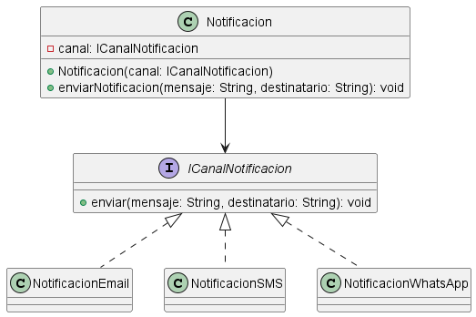

# Principio de Inversión de Dependencias (DIP)

## Propósito del principio
El Principio de Inversión de Dependencias establece que los módulos de alto nivel no deben depender de módulos de bajo nivel, sino de abstracciones.

## Motivación
En el sistema de turnos médicos, algunas clases dependen directamente de implementaciones concretas, lo que genera alto acoplamiento y dificulta el mantenimiento.

Por ejemplo:
El envío de notificaciones podría depender directamente de una implementación concreta, como NotificacionEmail.

Esto hace que si queremos cambiar el tipo de notificación (por SMS, WhatsApp, etc.), tengamos que modificar la clase Turno.

## Explicación de clases abstractas e interfaces

- **Interfaz**: define un contrato que las clases deben cumplir.
- **Clase abstracta**: puede tener comportamiento parcial y métodos sin implementar.

Se utilizan para que las clases dependan de abstracciones en lugar de implementaciones concretas.

## Estructura de clases

(ACÁ después insertás la imagen del diagrama)

## Justificación técnica

Se propone crear la interfaz ICanalNotificacion, que sea implementada por distintas clases como:

NotificacionEmail
NotificacionSMS

De esta manera, la clase Turno ya no depende de una implementación concreta, sino de la abstracción Notificacion.

Esto permite:

- Reducir acoplamiento
- Facilitar cambios
- Mejorar testeo

Además, este enfoque cumple con el principio DIP al invertir la dependencia: las clases de alto nivel dependen de una abstracción y no de implementaciones concretas.

## Inyección de dependencias

Para aplicar el principio DIP, se utiliza inyección de dependencias.

En el caso de las notificaciones, la clase Notificacion recibe una implementación de ICanalNotificacion mediante el constructor o un setter.

De esta forma, se puede cambiar el canal de envío sin modificar la lógica interna.

Esto permite mayor flexibilidad y facilita el testing.

## Decisiones de diseño

Se descartaron algunas abstracciones propuestas, como interfaces para los roles (IPaciente, IMedico), ya que no aportan directamente a la inversión de dependencias.

Se priorizó trabajar sobre componentes del sistema que 